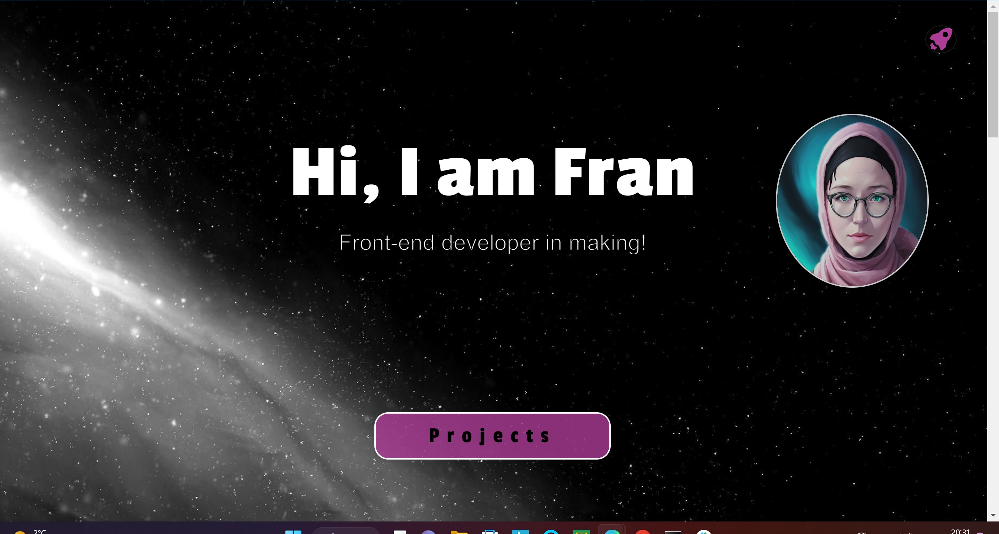

# Frans Bootstrap Portfolio

## Description

Portfolio created to showcase my work and present myself as a front-end developer. This portfolio has been done using Bootstrap 4.6 as a challenge for Bootcamp classes.
Contains 3 sections (about me, my work and contact). Also contains some Bootstraps JavaScript.
Conntains these Bootstrap components: navigation (in the rocke tbutton),jumbotron, carousel, Bootstrap grid  layout.

## Usage

Read in browser.

## Screenshot
Here is preview of my work.

## Link
[HERE](https://frantiskaali.github.io/FransBootstrapPortfolio/) you can find my deployed pages.

## Credits
Created by me(FrenaAli /Freantiska Rechkova) using Bootstrap 4.6.
